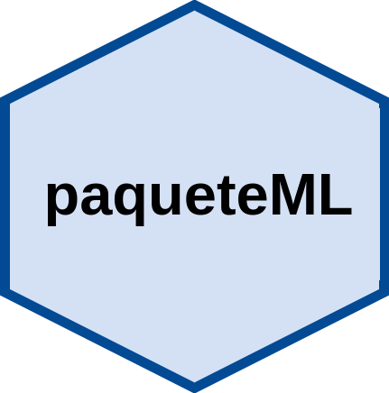

# **paqueteML**

<br/>
<center>

</center>

## **Introducción**

El presente contiene elemetos de apoyo al seminario **Manejo de bases de datos nacionale y mundiales sobre violencia**

Contiene :

* Bases de datos
* Funciones
* Tutoriales

<br/><br/>

## **Instalación**

```
install.packages("devtools")
devtools::install_github("Foodprice/Foodprice")
library(Foodprice)
```

<br/><br/>

## **Actualizaciones**

No se han realizado actualizaciones

La versión actual del paquete es : 0.1.0
